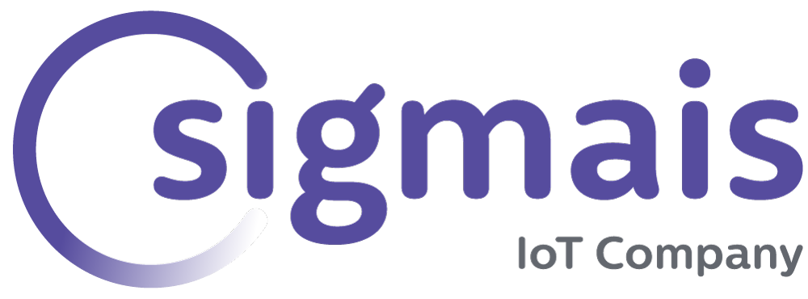
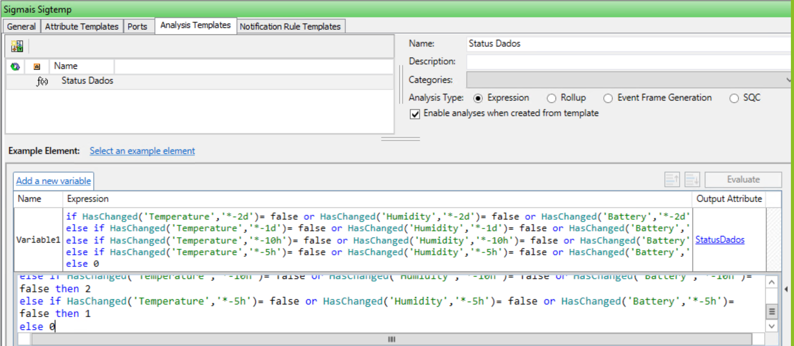

<div align = "justify">

# **Sigmeter - Sensor de Temperatura e Umidade**

## __Descrição Técnica__

Neste projeto, é utilizada uma rede de comunicação pública que visa a interação entre dispositivos inteligentes criada pela empresa <a href="https://www.sigfox.com/en">*Sigfox*</a> e também sensores autônomos de medições das características de um ambiente, como temperatura, umidade, etc, denonimados <a href="https://tudosobreiot.com.br/agora-ficou-facil-chegou-a-conectividade-sigfox-plug-play/">*Sigmeter*</a> que são fabricados pela empresa <a href="https://sigmais.io/br">*Sigmais*</a>.

## __Teoria__
### **Sigfox**


A Sigfox é uma empresa operadora de rede global francesa fundada em 2010 por Ludovic Le Moan, cujo objetivo é construir redes sem fio para conectar objetos de baixa energia, como sensores e dispositivos inteligentes, que precisam estar continuamente ativando e emitindo uma determinada quantidade de dados. É um modelo de rede muito utilizado para estabelecer a comunicação entre projetos desenvolvidos no segmento de <a href ="https://www.zdnet.com/article/what-is-the-internet-of-things-everything-you-need-to-know-about-the-iot-right-now/">IoT</a> (*Internet of Things* - Internet das Coisas).
### **Sigmais**

 

A Sigmais é uma <a href="https://www.sebrae.com.br/sites/PortalSebrae/artigos/o-que-e-uma-startup,6979b2a178c83410VgnVCM1000003b74010aRCRD">*Startup*</a> brasileira, fundada em 2017 por Guilherme Azevedo, que oferece soluções de dispositivos no ramo de IoT. A empresa realiza o processo de conectividade utilizando as redes do tipo <a href="https://www.thalesgroup.com/en/markets/digital-identity-and-security/iot/resources/innovation-technology/low-power-wide-area-technology">LPWAN (*Low-Power Wide-Area*)</a> como a Sigfox, até o <a href="https://www.totvs.com/blog/developers/back-end/">*backend*</a> IoT, que pode ser integrado com algum projeto via <a href="https://blog.vertigo.com.br/o-que-e-api-entenda-de-uma-maneira-simples/">API</a>. Neste projeto em específico, é utilizado o dispositivo Sigmeter, um sensor  capaz de medir as condições climáticas de um ambiente como temperatura e umidade, além de possuir um *reed switch* ou interruptor operado por um campo magnético, que permite a possibilidade de colocar o sensor em uma porta para saber quantas vezes a mesma foi aberta ou fechada, e como consequência, quantas pessoas passaram por uma determinada sala, garantindo um controle de acesso.

## __Scripts__

<br>


PHP é uma linguagem que foi criada em 1995 por Rasmus Lerdorf e atua com interpretação livre, sendo originalmente utilizada apenas para o desenvolvimento de aplicações presentes e atuantes no lado do servidor, capazes de gerar conteúdos dinâmicos em interfaces web.

Neste projeto são utilizados alguns scripts em <a href="https://www.php.net/manual/pt_BR/intro-whatis.php">PHP</a> para identificação dos sensores e além disso inserir os dados na plataforma da OSISoft através do PI Web API.

Script              |[sigtemp.php](sigtemp.php)
----------------------------|------------------------------------------
**Função**                      | Realizar a identificação do dispositivo que está sendo utilizado e enviar os dados para seus respectivos PI Points.

### **PI System**
 

O PI System™ é uma infraestrutura empresarial aberta que conecta dados baseados em sensores, sistemas e pessoas. O resultado é: informações acionáveis e em tempo real que capacitam as empresas a otimizar e transformar seus negócios.

## __Guia de Implementação__

### **PI Data Archive**

Foram criados 30 *points* para armazenar as informações de cada atributo no *Data Archive*.

*Points* criados para armazenar informações dos sensores Sigtemp.


### **Sigtemp Template**
Foi criado um template para organizar os elementos. Foram adicionadas todas as tags com um caminho genérico **\\%Server%\%..\..\Element%.%..\Element%.%Element%.%Attribute%**, que por sua vez busca o *point* de acordo com o diretório gerado pelos nomes dos elementos.

  

O template também contém análises para indicar se os dados estão atualizados.

Análise do status dos dados

  

### **Enumeration Sets**
Foram utilizados *enumeration sets* para transformar os números inteiros vindo das análises em frases para a melhor clareza das informações.


### **Elements**
A árvore de elementos foi criada de forma a trabalhar em conjunto com o template formando o caminho das *tags*.


### **Servidor**

Ubuntu 16.04.7 LTS com o IP: ```172.16.231.2```

## __Visualização criada no projeto__

 

## __Resultados Esperados__
O projeto deve receber um call back da Sigfox e inserir os dados no Data Archive através de uma Web API da OSISoft.

## __Pontos de Atenção__
 
Credenciais da <a href="https://dashboard.sigsystems.com.br/login
">Plataforma da Sigmais</a>   
Login: smartcampus@facens.br   
Senha: Smart2017!  

## __Referências__
**Sites**:

[Sigfox](https://www.sigfox.com/en "Sigfox")   
[tudosobreiot](https://tudosobreiot.com.br/agora-ficou-facil-chegou-a-conectividade-sigfox-plug-play/ "Sigmeter")  
[Sigmais](https://sigmais.io/br "Sigmais")  
[Zdnet](https://www.zdnet.com/article/what-is-the-internet-of-things-everything-you-need-to-know-about-the-iot-right-now/ "IoT")  
[Sebrae](https://www.sebrae.com.br/sites/PortalSebrae/artigos/o-que-e-uma-startup,6979b2a178c83410VgnVCM1000003b74010aRCRD "Startup")  
[Thalesgroup](https://www.thalesgroup.com/en/markets/digital-identity-and-security/iot/resources/innovation-technology/low-power-wide-area-technology "LPWAN")  
[Totvs](https://www.totvs.com/blog/developers/back-end/ "Backend")  
[Vertigo](https://blog.vertigo.com.br/o-que-e-api-entenda-de-uma-maneira-simples/ "API")  
[PHP](https://www.php.net/manual/pt_BR/intro-whatis.php "PHP")

## __Autores__
Centro Universitário Facens  
Equipe Técnica *Smart Campus*
Facens:  
Alison Meneses dos Santos  
Matheus Avilla Vial
</div>
